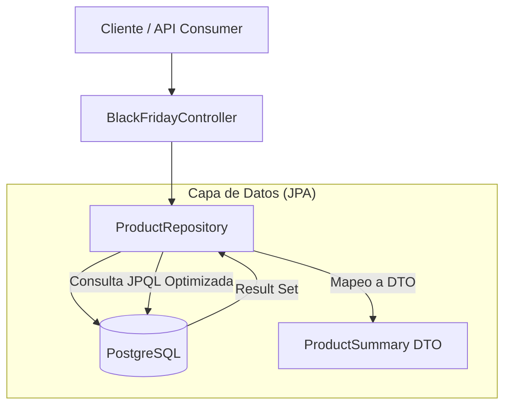

# Black Friday Performance Lab

## Introducción
Black Friday Performance Lab es una aplicación Spring Boot diseñada como un entorno de pruebas para diagnosticar y resolver problemas comunes de rendimiento en aplicaciones Java con persistencia de datos (JPA/Hibernate). El proyecto simula un catálogo de comercio electrónico bajo carga, permitiendo a los desarrolladores identificar cuellos de botella como el problema N+1, consultas ineficientes y configuraciones subóptimas de base de datos.

## Características Principales
*   **Simulación de Catálogo E-commerce:** Gestión de Productos, Variantes (talla/color), Imágenes y Reseñas.
*   **Seeder de Datos Masivos:** Carga automática de miles de registros (Productos, Imágenes, Variantes, Reviews) para pruebas de estrés.
*   **Diagnóstico de Rendimiento:** Configuración específica para visualizar SQL, estadísticas de Hibernate y trazas de binding.
*   **Dockerizado:** Entorno de base de datos PostgreSQL listo para usar con Docker Compose.
*   **Proyecciones DTO:** Ejemplos de optimización de consultas usando DTOs (Data Transfer Objects) en lugar de entidades completas.

## Arquitectura del Sistema
El sistema sigue una arquitectura monolítica clásica en capas, optimizada para la enseñanza de patrones de persistencia.



*   **Controller:** Expone endpoints REST para listar el catálogo.
*   **Repository:** Capa de acceso a datos usando Spring Data JPA. Implementa consultas personalizadas (JPQL) para evitar problemas de rendimiento.
*   **Domain:** Entidades JPA (`Product`, `ProductImage`, `ProductVariant`, `ProductReview`) con relaciones Lazy Loading.
*   **Database:** PostgreSQL 16 ejecutándose en contenedor Docker.

## Tecnologías Utilizadas
*   **Java 17+**
*   **Spring Boot 3** (Web, Data JPA)
*   **Hibernate ORM**
*   **PostgreSQL 16** (Base de datos)
*   **Docker & Docker Compose** (Infraestructura)
*   **Lombok** (Reducción de boilerplate)
*   **Maven** (Gestión de dependencias)

## Documentación de la API
La aplicación expone endpoints REST para interactuar con el catálogo.

### Endpoints Principales
*   `GET /api/catalog`: Obtiene un resumen optimizado del catálogo de productos (ID, Nombre, Precio, Imagen Principal).

### Ejecución
1.  Levantar la base de datos:
    ```bash
    docker-compose up -d
    ```
2.  Ejecutar la aplicación (el seeder cargará datos automáticamente en el primer inicio):
    ```bash
    ./mvnw spring-boot:run
    ```
