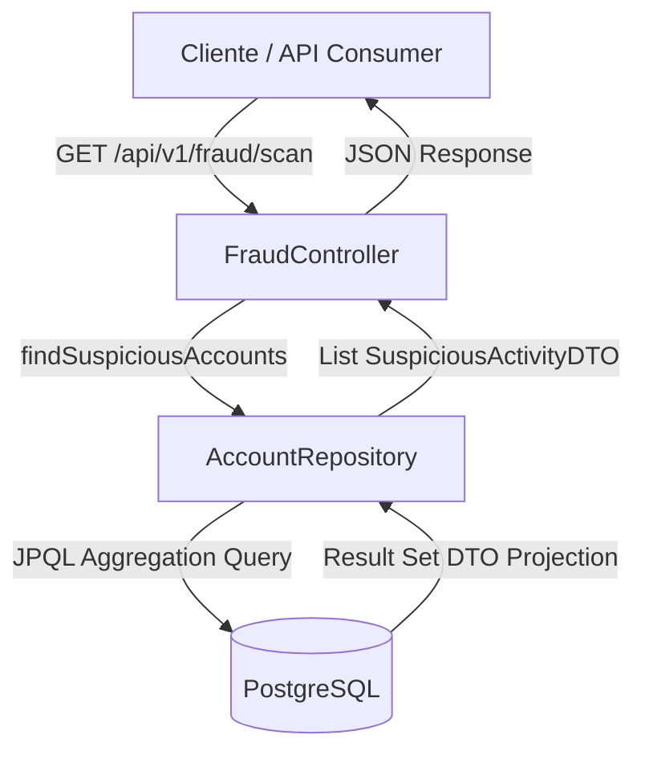

# Fraud Detection Service

## Introducción
**Fraud Detection Service** es un microservicio backend especializado en la seguridad financiera, diseñado para identificar patrones de comportamiento anómalos que sugieren la presencia de "cuentas mula" (money mules). El sistema analiza el historial transaccional de las cuentas para detectar aquellas que sirven como puente para el lavado de dinero, basándose en heurísticas configurables como el volumen de transacciones recientes y el saldo remanente.

## Características Principales
- **Detección de Cuentas Sospechosas**: Identifica cuentas con alto flujo de transacciones pero bajo saldo acumulado.
- **Consultas de Alto Rendimiento**: Utiliza proyecciones DTO (`SuspiciousActivityDTO`) y JPQL optimizado para evitar problemas de rendimiento (N+1) y reducir el consumo de memoria.
- **Generación de Escenarios de Prueba**: Incluye un `FraudDataSeeder` que, bajo el perfil `audit`, puebla la base de datos con casos de prueba claros (ej. "Mula Juan", "Honesto Pedro") para validar la lógica de detección.
- **Infraestructura Contenerizada**: Despliegue simplificado de la base de datos PostgreSQL mediante Docker Compose.

## Arquitectura del Sistema
El proyecto sigue una arquitectura en capas basada en Spring Boot. El controlador expone endpoints REST que invocan al repositorio. La capa de persistencia utiliza Spring Data JPA para interactuar con PostgreSQL, ejecutando consultas de agregación directamente en la base de datos para proyectar los resultados en objetos ligeros (DTOs).



## Tecnologías Utilizadas
- **Lenguaje**: Java 21
- **Framework**: Spring Boot (Web, Data JPA)
- **Base de Datos**: PostgreSQL 16
- **Infraestructura**: Docker & Docker Compose
- **Herramientas**: Lombok, Maven

## Documentación de la API
El servicio expone una API REST para la ejecución de los escaneos de fraude.

### Endpoints Principales

#### 1. Escanear Cuentas Mula
- **URL**: `/api/v1/fraud/scan`
- **Método**: `GET`
- **Descripción**: Ejecuta el algoritmo de detección para encontrar cuentas que cumplan con los criterios de sospecha (por defecto: actividad en las últimas 24h, saldo menor a 10.00 y más de 5 transacciones).
- **Respuesta Exitosa (200 OK)**:
  ```json
  [
    {
      "ownerName": "Mula Juan",
      "transactionsCount": 6,
      "currentBalance": 5.00
    }
  ]
  ```

### Configuración de Desarrollo
Para levantar el entorno localmente:
1. Iniciar la base de datos:
   ```bash
   docker-compose up -d
   ```
2. Ejecutar la aplicación con el perfil de auditoría para cargar datos de prueba:
   ```bash
   ./mvnw spring-boot:run -Dspring-boot.run.profiles=audit
   ```